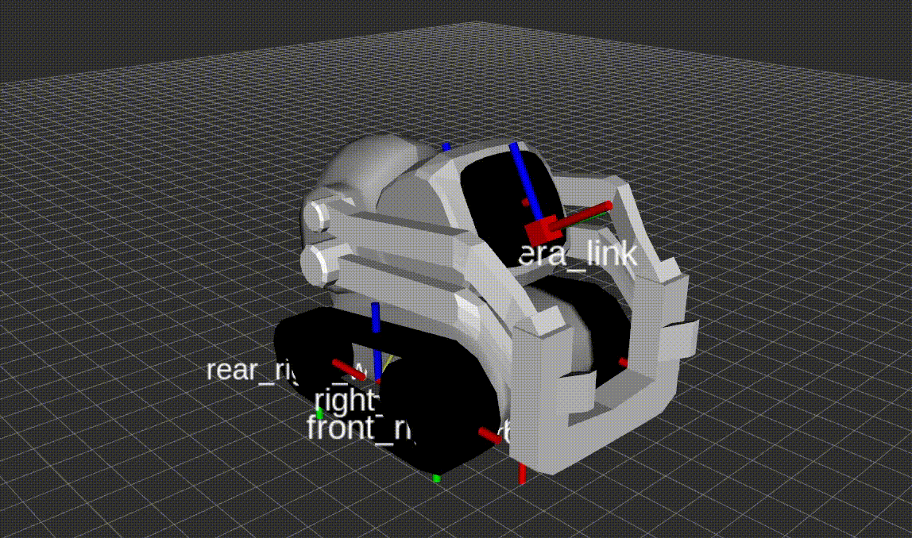
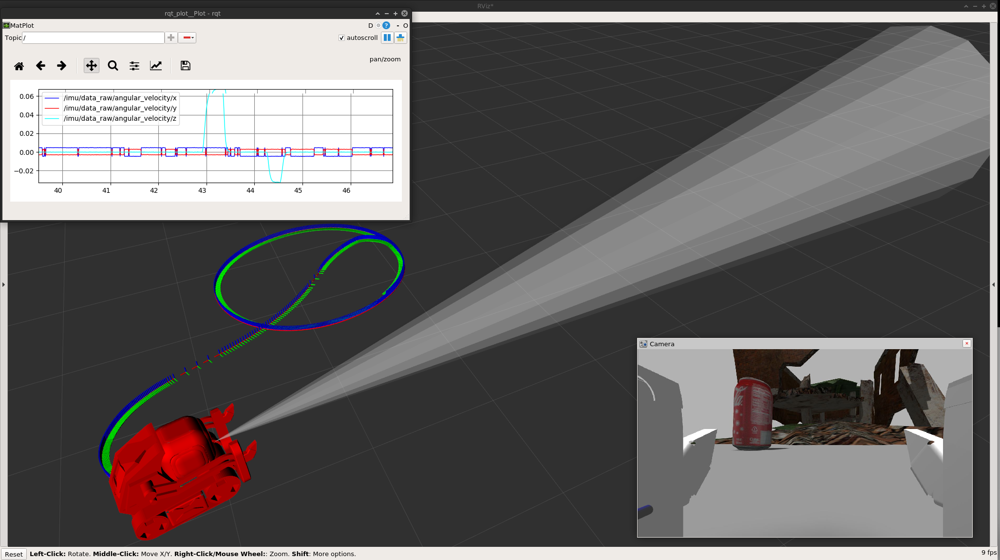

# Anki Vector and Cozmo #
### Universal Robot Description Files ###

To switch between Cozmo and Anki models change `robot_type` argument to:
* `vector` or
* `cozmo`

#### Models ####

- different meshes for Vector and Cozmo
- common base kinematics xacro
- robot type specific camera and drop sensor xacros
- standard gazebo plugins:
  - IMU: libgazebo_ros_imu_sensor
  - Camera: libgazebo_ros_camera
  - Kinematics: libgazebo_ros_skid_steer_drive
  - Cliff sensor: libgazebo_ros_range _( 1 for Cozmo 4 for Vector)_
  - NIR-TOF: libgazebo_ros_range _(Vector only)_

